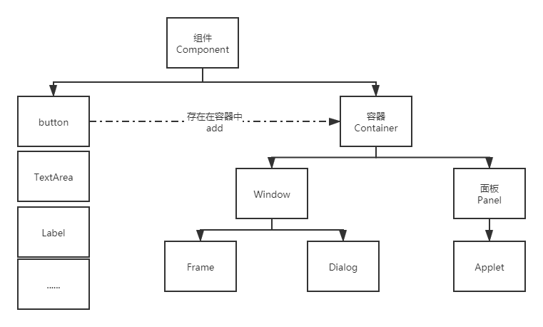
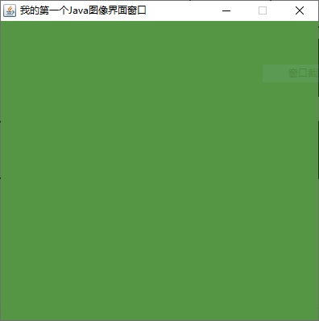
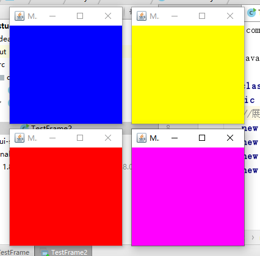

# GUI编程

这是什么？

该怎么玩？


组件

- 窗口
- 弹窗
- 面板
- 文本框
- 列表框
- 按钮
- 图片
- 监听事件
- 鼠标事件
- 键盘事件


## 1、简介

Gui的核心技术：Swing AWT

不流行的原因：

1.因为界面不美观。

2.需要jre环境！

为什么我们要学习？

1.可以写出自己心中想要的一些小工具

2.工作时候，也可能需要维护到swing界面，概率极小！

3.了解MVC架构，了解监听！


## 2、AWT

### 2.1、介绍

1.包含了很多的类和接口！

GUI：图形用户界面编程

2.元素：窗口、按钮、文本框

3.java.awt




### 2.2组件和容器

#### 1、Frame

```java
package com.ryan.lession01;

import java.awt.*;

//GUI的第一个界面
public class TestFrame {
    public static void main(String[] args) {

        //Frame，JDK，看源码！
        Frame frame = new Frame("我的第一个Java图像界面窗口");

        //需要设置可见性
        frame.setVisible(true);

        //设置窗口大小
        frame.setSize(400, 400);

        //设置背景颜色 Color
        frame.setBackground(new Color(85,150,68));

        //弹出的初始位置
        frame.setLocation(200,200);

        //设置大小固定
        frame.setResizable(false);

    }
}

```



问题：发现窗口关闭不掉，停止java程序运行！


尝试回顾封装：

```java
package com.ryan.lession01;

import java.awt.*;

public class TestFrame2 {
    public static void main(String[] args) {
        //展示多个窗口 new
        new MyFrame(100,100,200,200,Color.blue);
        new MyFrame(300,100,200,200,Color.yellow);
        new MyFrame(100,300,200,200,Color.red);
        new MyFrame(300,300,200,200,Color.MAGENTA);

    }
}

class MyFrame extends Frame{
    static int id = 0; //可能存在多个窗口，我们需要一个计数器

    public MyFrame(int x,int y,int w,int h,Color color){
        super("MyFrame"+(++id));
        setBackground(color);
        setBounds(x,y,w,h);
        setVisible(true);
    }
}

```

运行效果：




#### 2、面板Panel


不能单独存在