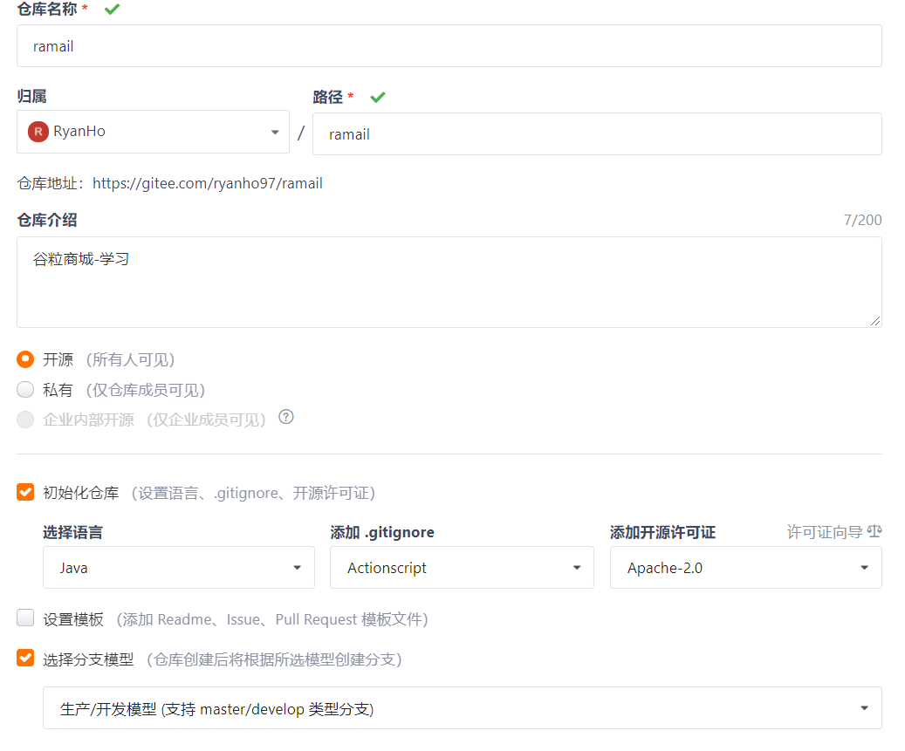

# 谷粒商城项目

一、环境搭建

1.安装VirtualBox

​	步骤：

- BIOS检查开启CPU的虚拟化。

- VirtualBox官网下载Window版本，安装

- 下载安装Vagrant

  https://www.vagrantup.com/downloads

  Windows 64-bit 版本

- 安装完成后提示重启电脑，重启后打开CMD输入vagrant，有提示信息说明安装成功了。

- 命令：vagrant init centos/7

- 命令：vagrant up （比较慢的）

- 命令：vagrant ssh 连虚拟机

#### 2.虚拟机网络设置

- vagrant 设置IP：打开CMD输入ipconfig，看到VirtualBox网卡的IPv4的地址。

  192.168.56.1

- 修改Vagrantfile此行

  \#config.vm.network "private_network", ip: "192.168.33.10" 

  config.vm.network "private_network", ip: "192.168.56.10" 

  保存

- 重启虚拟机的命令：vagrant reload

- 连接虚拟机，查看虚拟机ip，命令：ip addr

#### 3.测试网络互联

​	互相ping ip

#### 4.安装Docker

虚拟化容器技术。Docker基于镜像，可以秒级启动各种容器。每一种容器都是一个完整的运行环境，容器之间相互隔离。

Docker安装文档

https://docs.docker.com/

这里使用的是centos

https://docs.docker.com/engine/install/centos/

- 切换root用户，或使用sudo加命令

- 清除旧的Docker信息

  ```bash
   sudo yum remove docker \
                    docker-client \
                    docker-client-latest \
                    docker-common \
                    docker-latest \
                    docker-latest-logrotate \
                    docker-logrotate \
                    docker-engine
  ```

- 设置仓库

  ```bash
  sudo yum install -y yum-utils
  
  sudo yum-config-manager \
      --add-repo \
      https://download.docker.com/linux/centos/docker-ce.repo
  ```

- 安装Docker引擎

  ```bash
  sudo yum install docker-ce docker-ce-cli containerd.io
  ```

- 启动Docker

  ```bash
  sudo systemctl start docker
  ```

- 检查Docker版本

  ```bash
  docker -v
  ```

- 检查Docker下载了哪些个镜像

  ```bash
  sudo docker images
  ```

- 设置Docker开机自启

  ```bash
  sudo systemctl enable docker
  ```

#### 5.配置Docker镜像加速

打开阿里云-注册和登录-产品与服务-容器镜像服务-镜像工具-镜像加速器-选择centos

这个加速器地址为私有

只展示一部分命令

```bash
sudo mkdir -p /etc/docker
sudo tee /etc/docker/daemon.json <<-'EOF'
{
  "registry-mirrors": ["加速器的地址"]
}
EOF
sudo systemctl daemon-reload
sudo systemctl restart docker
```

#### 6.Docker安装Mysql

- 进入镜像仓库搜索mysql，地址：https://hub.docker.com/

- Tags下载Mysql5.7版本

  ```bash
  sudo docker pull mysql:5.7
  ```

- 检查安装状态

  ```bash
  sudo docker images
  ```

- 创建实例

  ```bash
  # --name指定容器名字 -v目录挂载 -p指定端口映射（linux:docker）  -e设置mysql参数 -d后台运行
  sudo docker run -p 3306:3306 --name mysql \
  -v /mydata/mysql/log:/var/log/mysql \
  -v /mydata/mysql/data:/var/lib/mysql \
  -v /mydata/mysql/conf:/etc/mysql \
  -e MYSQL_ROOT_PASSWORD=root \
  -d mysql:5.7
  ```

- 检查启动状态

  ```bash
  docker ps
  ```

- 使用工具连接

  这里我使用的Navicat

- 证明docker中的mysql服务是个linux

  ```bash
  docker exec -it mysql /bin/bash
  ```

  或者输入ID

- 进入centos的mydata目录下

  进入conf文件夹下

  使用vi创建my.conf配置文件

  文件内容：

  ```conf
  [client]
  default-character-set=utf8
  [mysql]
  default-character-set=utf8
  [mysqld]
  init_connect='SET collation_connection = utf8_unicode_ci'
  init_connect='SET NAMES utf8'
  character-set-server=utf8
  collation-server=utf8_unicode_ci
  skip-character-set-client-handshake
  skip-name-resolve
  ```

- 重启mysql服务

  ```bash
  docker restart mysql
  ```

- 检查docker容器里mysql的配置文件

  ``` bash
  docker exec -it mysql /bin/bash
  cd etc/mysql
  ls
  cat my.conf
  ```


至此，虚拟机的Mysql安装完毕


#### 7.Docker安装Redis

- 切换root账户

- 下载redis

  ```bash
  docker pull redis
  ```

- 创建目录结构之后挂载

  ```bash
  mkdir -p /mydata/redis/conf
  cd /mydata/redis/conf/
  touch redis.conf
  
  docker run -p 6379:6379 --name redis \
  -v /mydata/redis/data:/data \
  -v /mydata/redis/conf/redis.conf:/etc/redis/redis.conf \
  -d redis redis-server /etc/redis/redis.conf
  ```

- 检查redis运行情况

  ```bash
  docker ps
  ```

- 测试redis

  ```bash
  docker exec -it redis redis-cli
  ```

- 开启redis持久化，AOF的方式

  ```bash
  vim /mydata/redis/conf/redis.conf
  #插入下面内容
  appendonly yes
  
  docker restart redis
  ```

- 重启验证

- 可安装redis可视化工具：

  RedisDesktopManager

#### 8.开发工具环境配置

1. Maven配置阿里云的加速，配置仓库，配置JDK

2. IDEA装上插件

   - lombok

   - mybatisX

3. 前端工具VScode

4. VScode插件安装

   - Auto Close Tag
   - Auto Rename Tag
   - Chinese
   - ESlint
   - HTML CSS Support
   - HTML Snippets
   - JavaScript ES6
   - Live Server
   - open in brower
   - Vetur

5. 安装配置git

   - 下载git；https://git-scm.com/

   - 安装配置：https://www.cnblogs.com/xueweisuoyong/p/11914045.html

   - 配置账户信息

     ```bash
     git config --global user.name "ryanho97"
     
     git config --global user.email "1120177906@qq.com"
     ```

   - 配置ssh免密登录

     ```bash
     ssh-keygen -t rsa -C "1120177906@qq.com"
     ```

     需要回车三次

     查生成的密钥

     ```bash
     cat ~/.ssh/id_rsa.pub
     ```

     把密钥复制在gitee的ssh设置的页面

     添加公钥

     测试连接状态

     ```bash
     ssh -T git@gitee.com
     ```

     选择yes

     完成

#### 9.创建项目-微服务

- 从gitee初始化一个项目



- 复制项目git地址，创建新项目，File-New-Project from version control-Git

  添加git地址，clone

- 添加微服务模块

  - 
